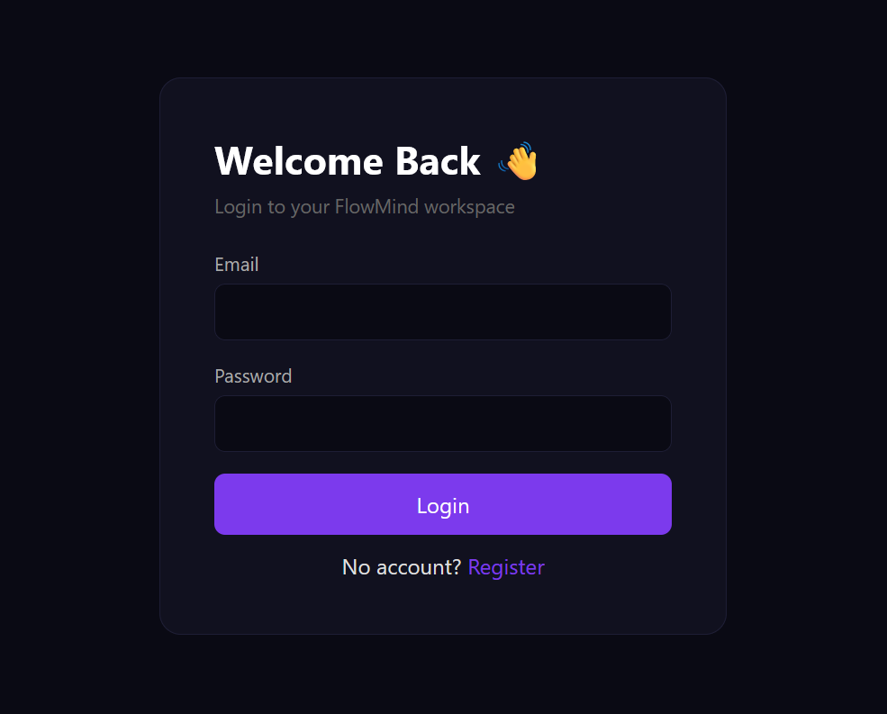
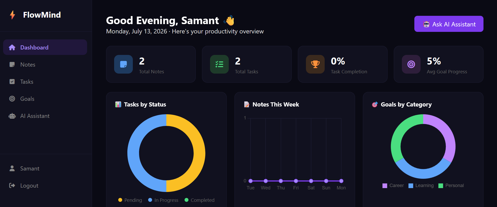
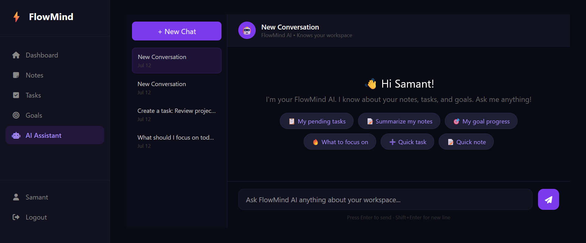
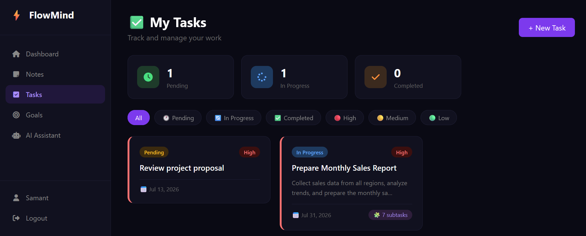
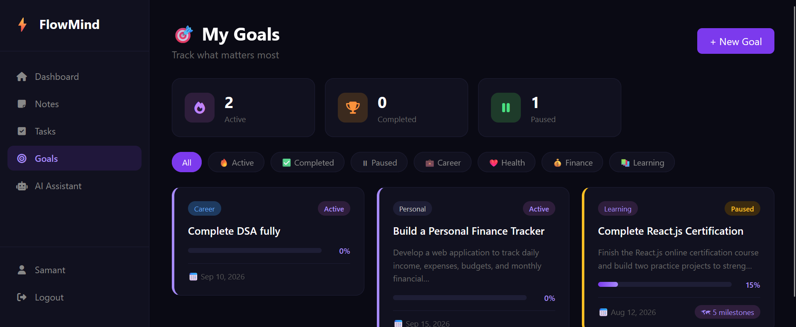

# ⚡ FlowMind — AI Powered Productivity OS

A full-stack SaaS productivity platform that combines task management,
goal tracking, note management and AI assistance into one intelligent workspace.

Built using Django, Django REST Framework, PostgreSQL and Groq LLaMA AI.

---

# 🚀 Features

## 📝 Smart Notes
- Create and organize notes
- Add tags
- Pin important notes
- AI summarization
- AI writing improvement


## ✅ AI Task Manager

- Create and manage tasks
- Priority management
- Status tracking
- AI generated subtasks
- AI prioritization suggestions


## 🎯 Goal Management

- Track personal/career goals
- Progress tracking
- AI coaching advice
- AI generated milestones


## 🤖 FlowMind AI Assistant

An AI chatbot that understands your workspace.

Capabilities:

- Reads user's notes, tasks and goals
- Provides productivity suggestions
- Creates tasks, notes and goals using AI tool calling


## 🔐 Authentication

Implemented:

- Django session authentication
- JWT authentication
- HttpOnly cookie storage
- Refresh token rotation
- Token blacklist


## 🌐 REST API

Built using Django REST Framework.

Supports:

- Authentication APIs
- Notes APIs
- Tasks APIs
- Goals APIs
- Dashboard analytics APIs


---

# 🏗 Architecture


User
 |
 |
Django Templates / REST API
 |
 |
Django Backend
 |
 |
PostgreSQL Database
 |
 |
Groq LLaMA AI


---

# 🛠 Tech Stack


| Category | Technology |
|-|-|
| Backend | Django |
| API | Django REST Framework |
| Authentication | JWT + Sessions |
| Database | PostgreSQL |
| AI Model | Groq LLaMA 3.3 70B |
| Frontend | Django Templates, HTMX |
| Deployment | Render/Railway |


---

# 🧠 AI Architecture


FlowMind AI uses:

1. User sends message

2. Backend retrieves:
- Notes
- Tasks
- Goals

3. Context is added to AI prompt

4. LLaMA generates response

5. Tool calls can execute actions:

Example:

User:
"Create a task to prepare resume"


AI:

```json
{
"tool":"create_task",
"params":{
"title":"Prepare resume"
}
}
```

Backend executes:

Create Task in PostgreSQL


---

# ⚙️ Installation


Clone:

```bash
git clone https://github.com/username/flowmind.git
cd flowmind
```


Create environment:

```bash
python -m venv venv

venv\Scripts\activate
```


Install dependencies:

```bash
pip install -r requirements.txt
```


Create `.env`


```
SECRET_KEY=
DEBUG=True

DATABASE_URL=

GROQ_API_KEY=
```


Run migrations:

```bash
python manage.py migrate
```


Create admin:

```bash
python manage.py createsuperuser
```


Run:

```bash
python manage.py runserver
```


---

# 📡 API Examples


| Method | Endpoint | Purpose |
|-|-|-|
| POST | /api/v1/auth/login | JWT Login |
| POST | /api/v1/auth/register | Register |
| GET | /api/v1/tasks | Get Tasks |
| POST | /api/v1/tasks | Create Task |
| GET | /api/v1/goals | Get Goals |


---

# 📸 Screenshots





(Add dashboard screenshots here)


---

# Future Improvements

- Mobile application using React Native
- Vector database based RAG
- Real-time chat using WebSockets
- Email reminders
- Advanced analytics
